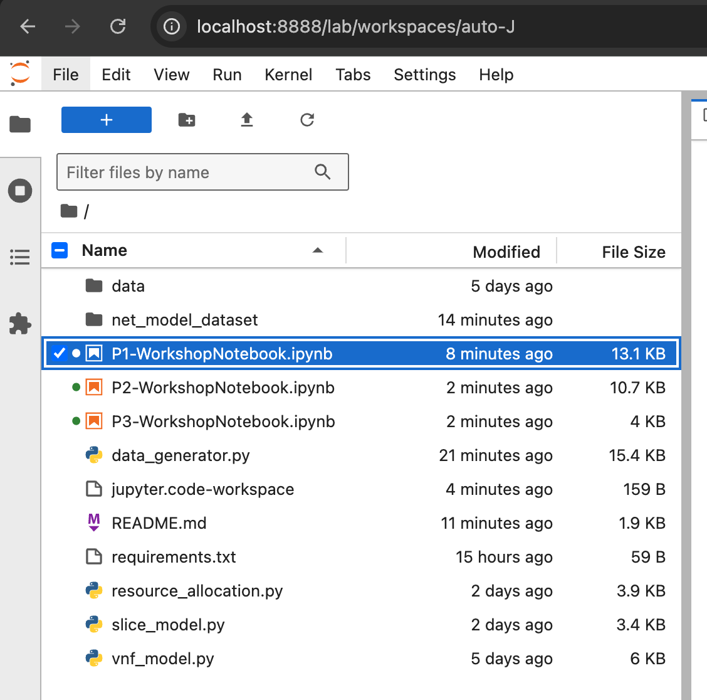

## Overview
This repository contains jupyter notebooks demonstrating how perform dyanamic resource scaling for 5G network slices using the vNetRunner and [MicroOpt](https://arxiv.org/abs/2407.18342) frameworks.

The notebooks are designed to be run in a JupyterLab environment. To get started, please follow the instructions below:

## Set up repository and environment

Clone the repository to your local machine:
```bash
git clone https://github.com/sulaimanalmani/5GDynamicResourceAllocation.git
cd 5GDynamicResourceAllocation/
```

Install the required python packages by running:
```bash
pip install -r requirements.txt
```

Download and extract the resource allocation dataset:
```bash
git clone https://github.com/sulaimanalmani/net_model_dataset.git
cd net_model_dataset
sh extract_data.sh
cd ../
```

Launch JupyterLab:
```bash
jupyter lab
```

Once you have launched JupyterLab, you can access the interface by clicking the link in the terminal. The link will be in the following format:

```bash
http://127.0.0.1:8000/?token=<token>
```

For more information on JupyterLab, you can refer to the [JupyterLab documentation](https://jupyterlab.readthedocs.io/en/stable/).

## Access the jupyter notebooks

We have devided the session into three notebooks:

1. P1-WorkshopNotebook.ipynb: In this notebook, we will be exploring and visualizing our resource allocation dataset gathered from the in-lab 5G testbed.
2. P2-WorkshopNotebook.ipynb: In this notebook, we will be using the datasets to train VNF models using the vNetRunner framework. Subsequently we will be using the trained VNF models to compose end-to-end slice models.
3. P3-WorkshopNotebook.ipynb: In this notebook, we will be using the [MicroOpt](https://arxiv.org/abs/2407.18342) framework to perform dynamic resource scaling.

Please open each of the notebook in order in the JupyterLab (as shown below) interface and follow the instructions in the notebook to complete the exercises.

<p align="center" style="background-color: white;">
  
</p>
